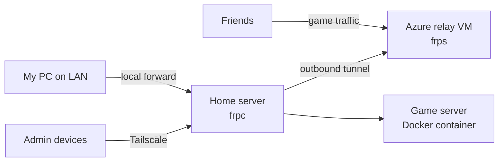

# Fujiken — Self-Hosted Home Lab Behind CGNAT

A home lab built on a repurposed gaming laptop. It hosts a modded Minecraft server
for a private group of friends, plus a self-hosted photo library and Docker
management tools.

The main challenge: my home internet is behind **CGNAT**, so I can't port-forward.
I solved it with a **reverse tunnel through a cloud relay VM**. The home network
never accepts any inbound connections.

> This is a sanitized, public version of my internal runbook. Hostnames, IPs,
> credentials, and internal paths have been removed.

---

## Architecture

- **The home server only makes outbound connections.** `frpc` dials out to the
  relay, and the relay forwards game traffic back through that tunnel. This is
  what gets around CGNAT.
- **The relay is stateless.** It only forwards traffic. If it dies, I can redeploy
  it in minutes with no data loss.
- **LAN players skip the relay** through a local port forward (~1 ms vs ~90 ms).
- **Admin access goes over Tailscale** only. Management tools are never exposed
  through the public tunnel.
- **ISP-independent.** Since everything dials out, I can switch ISPs or routers
  without touching the relay, DNS, or DDNS.

This is the same pattern that Cloudflare Tunnel and ngrok sell as a product. I
built a self-hosted version to understand how it works.

---

## Stack

| Layer | Tools |
| --- | --- |
| Hardware | Ryzen 5 6600H laptop, 24 GB RAM, external NVMe, UPS |
| OS | Ubuntu Server 24.04 LTS (LVM) |
| Cloud relay | Microsoft Azure VM (Ubuntu), network security group firewall |
| Tunneling | frp (reverse proxy), Tailscale (admin VPN) |
| Game hosting | Pterodactyl panel + Wings, Docker, NeoForge 1.21.1 (130+ mods) |
| Panel backend | nginx, PHP-FPM, MariaDB, Redis |
| Other services | Immich (photos), Syncthing, Portainer |
| Security | UFW, fail2ban, key-only SSH |
| Monitoring | Custom Bash scripts, Python web dashboard, Telegram bot |

---

## Security

**Design choices**
- Zero inbound exposure on the home network. The real home IP is hidden behind the relay.
- Two firewall layers: the Azure network security group plus UFW on each host.
  Only the ports the service needs are open.
- SSH is key-only, root login is disabled, and fail2ban runs on both hosts.
- The database is bound to localhost only.
- Management UIs (panel, Docker UI, dashboard) are LAN or Tailscale only.
- Each game server runs in its own Docker container.

**Penetration test**

I ran a read-only recon assessment against my own setup from Kali Linux (WSL2),
using nmap, nikto, and manual banner grabbing against both the LAN and the public
relay.

- **Finding (medium, fixed):** MariaDB was listening on all interfaces, so any
  device on the LAN could reach it. I rebound it to localhost and confirmed the
  port was closed with a follow-up scan.
- **Informational findings:** I documented these as accepted risks, each with a
  written reason and a fix ready if the threat model changes.
- **External surface confirmed minimal:** only the tunnel and SSH ports are
  reachable from the internet. Everything else is filtered.

**Telegram bot hardening**

The ops bot can restart services, so I designed it to be safe:
- It only runs a fixed whitelist of commands. There's no shell or eval command.
- It ignores messages from any chat except mine.

---

## Monitoring & Operations

- **Health checks:** one script per host. Together they show which side is broken
  (home server or relay).
- **Web dashboard:** a custom Python dashboard with live graphs and a JSON metrics
  endpoint.
- **Terminal dashboard:** live CPU, RAM, disk temp, network, and container status.
- **Telegram bot:** sends a status report every 2 hours and reports electricity
  cost on demand. It can also restart services and trigger backups remotely, with
  an alert if a backup fails.
- **Power tracking:** logs CPU power every minute and estimates wall draw and
  monthly electricity cost from local utility rates.
- **Automation:** cron handles the nightly shutdown, weekly backups, and a CPU
  frequency cap on boot to keep temps stable.
- **Cost awareness:** I track cloud egress against the free tier. It averages
  about 15 GB/month against a 100 GB limit.

---

## Incidents & Lessons Learned

Real problems I diagnosed and fixed:

| Problem | Root cause | Fix |
| --- | --- | --- |
| Server shut down at 10 AM instead of 2 AM | System timezone was UTC, so cron ran 8 hours off | Set the correct timezone, and documented it as a post-install step |
| Panel console stuck loading after the timezone fix | The game daemon cached auth tokens from before the clock jumped | Restarted the daemon |
| Boot hung waiting for the network | Ethernet was unplugged, so the network wait never finished | Found the cause. Planned fix: mark the interface optional |
| Server went offline mid-day | ISP outage, not hardware | Used missed scheduled reports to pin down the downtime window |
| Players crashed on join after a mod update | Client and server configs didn't match | Set a rule: every change goes to the server and all clients at once |
| Couldn't SSH into the relay from Windows | The key file was readable by other user groups, so OpenSSH refused it | Removed the extra permissions until only my user could read the key |
| Drive failed to boot | External drive's USB-C cable failed | Swapped cables and documented a spare-cable policy |

Some honest gaps I've found in my own setup and plan to fix:

- Weekly backups get skipped if the machine is off at the scheduled time.
  Plan: catch-up backup on boot, plus automatic rotation.
- Backups are on the same drive as the server. Plan: add offline and offsite copies.

---

## Documentation

I keep a detailed internal runbook covering:
- component inventory and port map
- boot and daily operations
- a crontab reference
- a maintenance schedule
- a troubleshooting table built from real incidents
- security posture and accepted risks
- a disaster recovery plan
- a cost breakdown

This README is the public summary.

---

## Roadmap

- Automated backup rotation, plus an offsite copy to cloud storage
- Move admin SSH on the relay to Tailscale only, and close the public SSH port
- Wazuh (HIDS) for security monitoring
- Dedicated mini PC running Proxmox to replace the laptop
